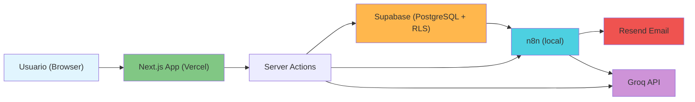

# AI Recruitment Platform

ATS (Applicant Tracking System) con análisis de CVs potenciado por IA, automatización de procesos de reclutamiento y gestión de entrevistas.

## Stack

| Capa | Tecnología |
|------|-----------|
| Framework | Next.js 15 (App Router), React 19, TypeScript 5 |
| UI | Tailwind CSS 4 |
| Backend | Supabase (Auth, PostgreSQL 17, RLS) |
| IA | Groq API (`llama-3.3-70b-versatile`) |
| Automatización | n8n (local) + Cloudflare Tunnel |
| Email | Resend |
| Tests | Vitest + Testing Library |
| Git hooks | Husky + lint-staged |
| Deploy | Vercel |

## Arquitectura



## Funcionalidades

- **Auth**: Login/registro con email, sesión persistente vía cookies, RLS policies
- **Dashboard**: KPIs (vacantes activas, candidatos, entrevistas, score promedio), gráfico de distribución por etapa, tabla de candidatos recientes
- **Vacantes**: CRUD completo, estados (Borrador/Publicada/Cerrada), enlace público para postularse
- **Candidatos**: Creación con carga de PDF y análisis automático vía Groq (score 0-100, seniority, resumen, sugerencias, nivel de riesgo), 7 etapas del pipeline, ranking visual con score gauge
- **Entrevistas**: Agendamiento con fecha y notas, edición, cancelación, finalización
- **Token Usage**: Dashboard de uso de IA con KPIs (tokens totales, costo estimado, prompts, calls), gráfico semanal, tabla de últimos 20 logs
- **Postulación pública**: Landing page con vacantes publicadas, formulario de aplicación con carga de PDF, análisis IA instantáneo, score visual
- **Automatización n8n**: 3 workflows (candidato creado, cambio de etapa, entrevista agendada) que envían notificaciones por email vía Resend

## Estructura del proyecto

```
src/
├── app/
│   ├── page.tsx                  # Landing page pública
│   ├── layout.tsx                # Root layout
│   ├── globals.css               # Tailwind CSS v4
│   ├── (auth)/login/             # Login / Registro
│   ├── (dashboard)/
│   │   ├── layout.tsx            # Dashboard layout con navbar
│   │   ├── dashboard/            # KPIs, gráficos, tabla
│   │   ├── jobs/                 # Vacantes (list, new, [id])
│   │   │   └── [id]/candidates/  # Crear candidato + análisis IA
│   │   ├── candidates/           # Candidatos (list, [id])
│   │   ├── interviews/           # Entrevistas (list, new, actions)
│   │   └── tokens/               # Uso de IA (force-dynamic)
│   └── apply/[jobId]/            # Postulación pública
├── components/
│   ├── apply/                    # ApplyForm, ApplySuccess
│   ├── jobs/                     # JobList, JobForm, ShareLink
│   ├── candidates/               # CandidateList, CVAnalysis, StageControls
│   ├── dashboard/                # KPICards, StageChart, RecentCandidates
│   ├── interviews/               # InterviewForm, InterviewCard
│   ├── tokens/                   # UsageCards, UsageChart, UsageTable
│   └── shared/
│       ├── ui/                   # Button, Input, Card, Badge, Select, ConfirmDialog, BackButton
│       └── utils/                # cn()
├── lib/
│   ├── supabase/
│   │   ├── client.ts             # Cliente browser
│   │   ├── server.ts             # Cliente server component
│   │   ├── middleware.ts         # Cliente middleware
│   │   └── admin.ts              # Cliente service_role
│   └── ai.ts                     # callAIApi, parseAIScore
├── middleware.ts                 # Session refresh + redirects
└── types/database.ts             # Tipos de BD autogenerados

supabase/
├── migrations/                   # 001-005 SQL migrations
└── rpc/                          # insert_ai_log, update_candidate_stage, schedule_interview

n8n-workflows/                    # 3 workflows n8n (JSON)
docs/                             # Documentación técnica (5 archivos)
```

## Rutas

| Ruta | Acceso | Descripción |
|------|--------|-------------|
| `/` | Público | Landing page con vacantes publicadas |
| `/login` | Público | Inicio de sesión / registro |
| `/apply/[jobId]` | Público | Postulación a vacante |
| `/dashboard` | Autenticado | KPIs y métricas |
| `/jobs` | Autenticado | Lista de vacantes |
| `/jobs/new` | Autenticado | Crear vacante |
| `/jobs/[id]` | Autenticado | Detalle de vacante |
| `/jobs/[id]/candidates` | Autenticado | Candidatos de una vacante |
| `/jobs/[id]/candidates/new` | Autenticado | Crear candidato + análisis IA |
| `/candidates` | Autenticado | Lista global de candidatos |
| `/candidates/[id]` | Autenticado | Detalle de candidato |
| `/interviews` | Autenticado | Lista de entrevistas |
| `/interviews/new` | Autenticado | Agendar entrevista |
| `/tokens` | Autenticado | Dashboard de uso de IA |

## Base de datos

| Tabla | Descripción |
|-------|-------------|
| `recruiters` | Perfiles de reclutadores (se crean automáticamente vía trigger al registrarse) |
| `jobs` | Vacantes con título, descripción, requisitos, estado (borrador/publicada/cerrada) |
| `candidates` | Candidatos por vacante, con CV extraído en `raw_cv_data` (JSONB) |
| `scores` | Análisis IA: score 0-100, summary, classification, suggestions, risk_level, suggested_next_step |
| `interviews` | Entrevistas agendadas con fecha, estado (pendiente/completada/cancelada) y notas |
| `ai_logs` | Auditoría de invocaciones a IA: prompt, response, tokens, latencia, modelo |

### RLS Policies

- `recruiters`: Cada reclutador ve/edita solo su propio perfil
- `jobs`: CRUD solo del reclutador owner; `SELECT` público si `status = 'published'`
- `candidates`: CRUD solo del reclutador dueño de la vacante
- `scores`: CRUD solo del reclutador dueño del candidato
- `interviews`: CRUD solo del reclutador dueño del candidato
- `ai_logs`: SELECT/INSERT para usuarios autenticados

## Autenticación y Middleware

El middleware (`src/middleware.ts`) refresca la sesión en cada request y redirige según el estado:

- Usuario **no autenticado** en rutas dashboard → redirige a `/login`
- Usuario **autenticado** en `/` o `/login` → redirige a `/dashboard`
- Rutas públicas: `/`, `/login`, `/apply/*` — sin restricción

## Setup local

```bash
# 1. Clonar
git clone https://github.com/Bbjoker15/AI-Recruitment-Platform.git
cd AI-Recruitment-Platform

# 2. Instalar dependencias
npm install

# 3. Variables de entorno
cp .env.local.example .env.local
# Editar .env.local con tus claves

# 4. Iniciar servidor de desarrollo
npm run dev
# Abrir http://localhost:3000
```

### Variables de entorno

| Variable | Descripción |
|----------|-------------|
| `NEXT_PUBLIC_SUPABASE_URL` | URL del proyecto Supabase |
| `NEXT_PUBLIC_SUPABASE_ANON_KEY` | Anon key de Supabase |
| `GROQ_API_KEY` | API key de Groq para análisis de CV |
| `N8N_WEBHOOK_BASE_URL` | URL del túnel Cloudflare para n8n |

## Scripts

| Comando | Descripción |
|---------|-------------|
| `npm run dev` | Servidor de desarrollo |
| `npm run build` | Build de producción |
| `npm run start` | Iniciar servidor de producción |
| `npm run lint` | Linting (ESLint) |
| `npm test` | Ejecutar tests (Vitest) |
| `npm run test:watch` | Tests en modo watch |

## Testing

39 tests distribuidos en 5 archivos:

| Archivo | Tests | Descripción |
|---------|-------|-------------|
| `src/lib/__tests__/ai.test.ts` | 15 | `parseAIScore` — parsing de respuestas de Groq |
| `src/components/shared/ui/__tests__/Button.test.tsx` | 7 | Componente Button |
| `src/components/shared/ui/__tests__/Badge.test.tsx` | 7 | Componente Badge |
| `src/components/shared/ui/__tests__/BackButton.test.tsx` | 3 | Componente BackButton |
| `src/components/apply/__tests__/ApplySuccess.test.tsx` | 7 | Componente ApplySuccess |

Ejecutar: `npm test`

## Git Hooks

Configurados con Husky v9 + lint-staged:

- **pre-commit**: Ejecuta `eslint --fix` en archivos `.ts/.tsx` staged
- **pre-push**: Ejecuta `tsc --noEmit` para verificar tipos

## Deploy

El proyecto está deployado en **Vercel**. Los deploys se disparan automáticamente al hacer push a `main`.

**Variables de entorno requeridas en Vercel:**
- `NEXT_PUBLIC_SUPABASE_URL`
- `NEXT_PUBLIC_SUPABASE_ANON_KEY`
- `GROQ_API_KEY`

> Nota: `N8N_WEBHOOK_BASE_URL` no es necesaria en producción porque los webhooks se disparan desde Server Actions, no desde la base de datos.

## n8n (automatización local)

La plataforma incluye 3 workflows n8n para notificaciones por email:

1. **candidate-created**: Notifica cuando se crea un candidato
2. **candidate-stage-change**: Notifica cuando un candidato cambia de etapa
3. **interview-scheduled**: Genera guía de entrevista vía Groq y envía email al reclutador

Requisitos:
- n8n corriendo localmente en `http://localhost:5678`
- Cloudflare Tunnel exponiendo n8n al exterior
- Plugin `n8n-nodes-resend` instalado en n8n
- Importar los workflows desde `n8n-workflows/`

```powershell
# Iniciar túnel Cloudflare
cloudflared tunnel --url http://localhost:5678

# Actualizar N8N_WEBHOOK_BASE_URL en .env.local con la URL del túnel
# Luego reiniciar npm run dev
```

## Documentación

La documentación completa del proyecto está disponible en `docs/`:

| Archivo | Contenido |
|---------|-----------|
| `01-INFORME-TECNICO.md` | Stack, arquitectura, rutas, componentes, autenticación, testing |
| `02-BASE-DE-DATOS.md` | Diagrama ER, 6 tablas, RLS policies, RPCs, índices |
| `03-MANUAL-USUARIO.md` | Manual de usuario: todos los módulos y flujo público |
| `04-FLUJOS-DIAGRAMAS.md` | 12 diagramas Mermaid (arquitectura, auth, middleware, AI, n8n) |
| `05-METODOLOGIA.md` | Metodología, justificación del stack, decisiones clave, roadmap |
