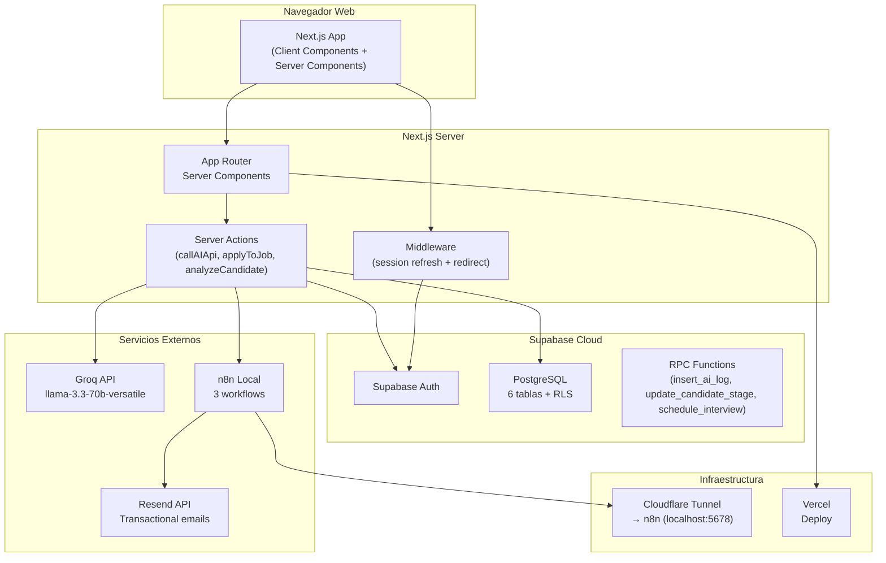
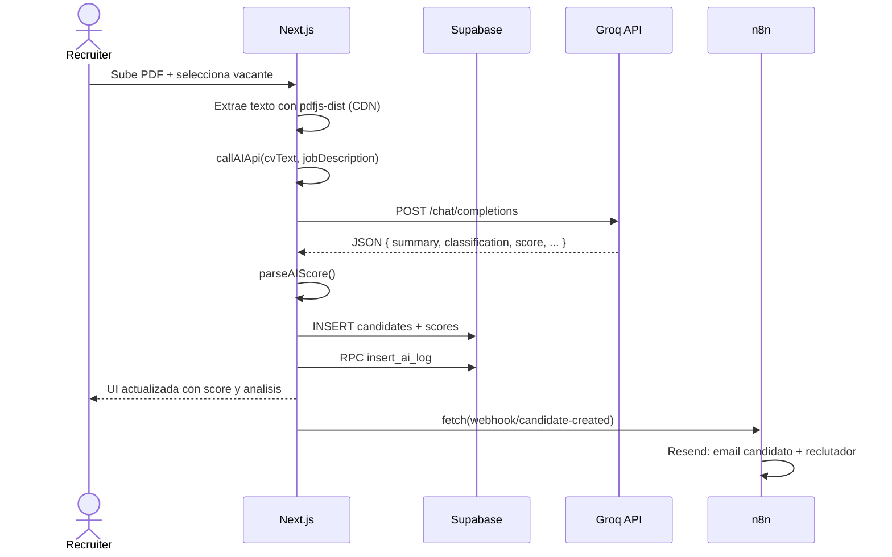
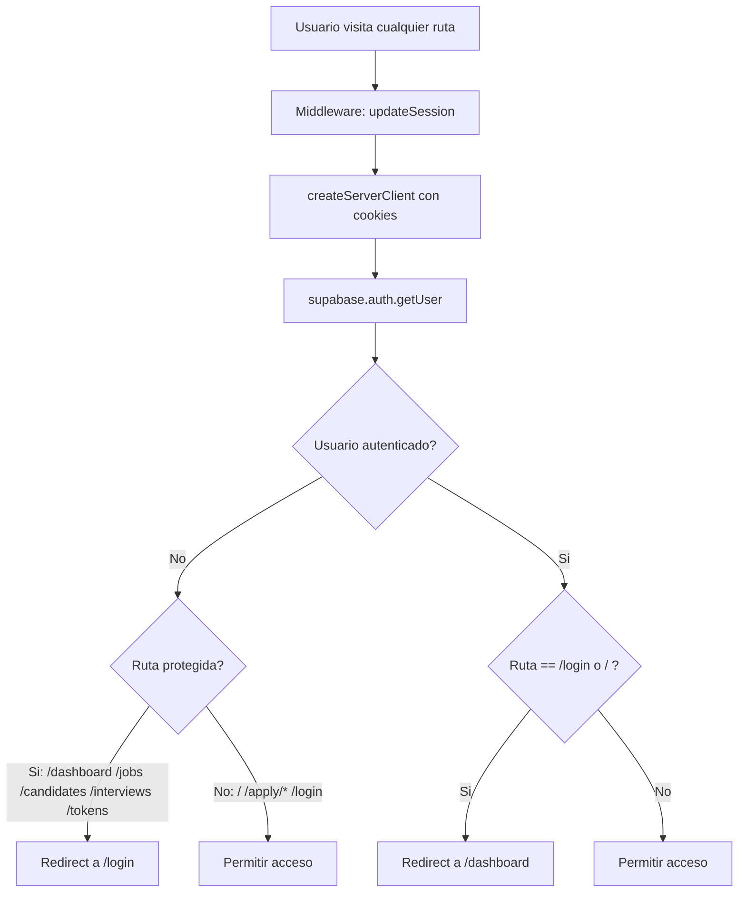

# AI Recruitment Platform - Informe Tecnico

> **Version:** 1.0.0  
> **Fecha:** Junio 2026  
> **Stack:** Next.js 15 + React 19 + Supabase + Tailwind CSS 4 + Groq AI + n8n + Resend

---

## Tabla de contenidos

1. [Resumen ejecutivo](#1-resumen-ejecutivo)
2. [Stack tecnologico](#2-stack-tecnologico)
3. [Arquitectura del sistema](#3-arquitectura-del-sistema)
4. [Estructura del proyecto](#4-estructura-del-proyecto)
5. [Descripcion de archivos de configuracion](#5-descripcion-de-archivos-de-configuracion)
6. [Paginas y enrutamiento](#6-paginas-y-enrutamiento)
7. [Componentes reutilizables](#7-componentes-reutilizables)
8. [Autenticacion y middleware](#8-autenticacion-y-middleware)
9. [Clientes de Supabase](#9-clientes-de-supabase)
10. [Sistema de pruebas](#10-sistema-de-pruebas)

---

## 1. Resumen ejecutivo

**AI Recruitment Platform** es una aplicacion web full-stack para la gestion integral de reclutamiento, potenciada con inteligencia artificial que analiza curriculums, asigna scores de compatibilidad y sugiere el siguiente paso en el pipeline de contratacion.

La aplicacion utiliza un modelo de un solo rol:

| Rol | Descripcion |
|-----|-------------|
| **Recruiter** | Gestiona vacantes, evalua candidatos, programa entrevistas y supervisa metricas |

La plataforma incluye un flujo de **postulacion publica** donde los candidatos pueden enviar su CV desde un enlace compartible, recibiendo un analisis automatico por IA y una confirmacion por email via n8n + Resend.

El backend (persistencia, autenticacion, RLS) vive en **Supabase**, el motor de IA es **Groq** (modelo `llama-3.3-70b-versatile`), las automatizaciones de email corren en **n8n** local detras de un tunel Cloudflare, y el deploy esta en **Vercel**.

---

## 2. Stack tecnologico

| Tecnologia | Version | Proposito |
|------------|:-------:|-----------|
| **Next.js** | ^15.2.0 | Framework React con App Router y Server Components |
| **React** | ^19.1.0 | Libreria UI |
| **Tailwind CSS** | ^4 | Framework CSS utility-first |
| **Supabase SSR** | ^0.6.1 | Autenticacion con cookies para App Router |
| **Supabase JS** | ^2.108.1 | Cliente oficial para Auth y Postgres |
| **Groq API** | - | LLM `llama-3.3-70b-versatile` para analisis de CV |
| **n8n** | - | Automatizacion de workflows (emails) |
| **Resend** | - | Envio de correos transaccionales |
| **pdfjs-dist** | 4.0.379 | Extraccion de texto de PDFs via CDN |
| **Vitest** | ^4.1.8 | Framework de testing |
| **Husky** | ^9.1.7 | Git hooks |
| **lint-staged** | ^17.0.7 | Linter en staged files |
| **ESLint** | ^9 | Linter con configuracion `eslint-config-next` |

### Dependencias del proyecto (`package.json`)

```json
{
  "dependencies": {
    "@supabase/ssr": "^0.6.1",
    "@supabase/supabase-js": "^2.108.1",
    "next": "^15.2.0",
    "react": "^19.1.0",
    "react-dom": "^19.1.0"
  },
  "devDependencies": {
    "@testing-library/jest-dom": "^6.9.1",
    "@testing-library/react": "^16.3.2",
    "@testing-library/user-event": "^14.6.1",
    "@vitejs/plugin-react": "^6.0.2",
    "husky": "^9.1.7",
    "jsdom": "^29.1.1",
    "lint-staged": "^17.0.7",
    "tailwindcss": "^4",
    "typescript": "^5",
    "vitest": "^4.1.8",
    "eslint": "^9",
    "eslint-config-next": "^15.2.0"
  }
}
```

### Scripts disponibles

| Comando | Descripcion |
|---------|-------------|
| `npm run dev` | Inicia servidor de desarrollo en `localhost:3000` |
| `npm run build` | Genera build de produccion |
| `npm run start` | Sirve la build de produccion |
| `npm run lint` | Ejecuta ESLint con configuracion de Next.js |
| `npm test` | Ejecuta tests con Vitest (una vez) |
| `npm run test:watch` | Ejecuta tests en modo watch |

---

## 3. Arquitectura del sistema



### Flujo de datos tipico (analisis de CV)



---

## 4. Estructura del proyecto

```
ai-recruitment-platform/
├── .husky/
│   ├── pre-commit                 # Hook: npx lint-staged
│   └── pre-push                   # Hook: npx tsc --noEmit
├── docs/                          # Documentacion
│   ├── 01-INFORME-TECNICO.md
│   ├── 02-BASE-DE-DATOS.md
│   ├── 03-MANUAL-USUARIO.md
│   ├── 04-FLUJOS-DIAGRAMAS.md
│   └── 05-METODOLOGIA.md
├── n8n-workflows/                 # Workflows de n8n (JSON)
│   ├── candidate-created.json
│   ├── candidate-stage-change.json
│   └── interview-scheduled.json
├── public/                        # Assets estaticos
├── src/
│   ├── app/                       # App Router de Next.js
│   │   ├── layout.tsx             # Layout raiz
│   │   ├── page.tsx               # Landing page
│   │   ├── globals.css            # Estilos globales + Tailwind
│   │   ├── (auth)/
│   │   │   └── login/
│   │   │       └── page.tsx       # Inicio de sesion / registro
│   │   ├── (dashboard)/           # Rutas protegidas
│   │   │   ├── layout.tsx         # Layout con DashboardNav
│   │   │   ├── _components/
│   │   │   │   └── DashboardNav.tsx
│   │   │   ├── dashboard/         # KPIs, metricas
│   │   │   ├── jobs/              # CRUD de vacantes
│   │   │   │   ├── page.tsx       # Lista de vacantes
│   │   │   │   ├── new/           # Crear vacante
│   │   │   │   ├── [id]/
│   │   │   │   │   ├── page.tsx   # Detalle de vacante
│   │   │   │   │   ├── edit/      # Editar vacante
│   │   │   │   │   └── candidates/
│   │   │   │   │       ├── new/   # Subir CV + analisis
│   │   │   │   │       └── actions.ts # Server Actions
│   │   │   ├── candidates/        # Lista y detalle
│   │   │   ├── interviews/        # CRUD de entrevistas
│   │   │   └── tokens/            # Uso de tokens IA
│   │   └── apply/                 # Postulacion publica
│   │       ├── layout.tsx
│   │       └── [jobId]/
│   │           ├── page.tsx       # Formulario de postulacion
│   │           └── actions.ts     # Server Action publico
│   ├── components/
│   │   ├── apply/                 # ApplyForm, ApplySuccess
│   │   ├── candidates/            # CandidateList, CVAnalysis, StageControls
│   │   ├── interviews/            # InterviewForm, EditInterviewForm
│   │   ├── jobs/                  # JobList, JobForm, JobActions, ShareLink
│   │   ├── tokens/                # UsageCards, UsageChart, UsageTable
│   │   └── shared/
│   │       ├── ui/                # Button, Badge, Card, Input, Select, BackButton, ConfirmDialog
│   │       ├── utils/             # cn()
│   │       └── hooks/
│   ├── lib/
│   │   ├── supabase/
│   │   │   ├── client.ts          # Cliente browser
│   │   │   ├── server.ts          # Cliente server (cookies)
│   │   │   ├── middleware.ts       # Session refresh + redirect
│   │   │   └── admin.ts           # Cliente service_role
│   │   ├── ai.ts                  # callAIApi, parseAIScore
│   │   └── ...
│   ├── middleware.ts              # Middleware de Next.js
│   ├── test/                      # Setup de tests
│   │   └── setup.ts
│   └── types/
│       └── database.ts            # Tipos de Supabase
├── supabase/
│   ├── migrations/                # Migraciones SQL
│   └── rpc/                       # RPC functions SQL
├── .env.local                     # Variables de entorno
├── vitest.config.ts               # Configuracion de Vitest
├── next.config.ts                 # Configuracion de Next.js
├── tailwind.config.ts             # Configuracion de Tailwind
├── tsconfig.json                  # Configuracion de TypeScript
├── README.md                      # Documentacion principal
└── package.json                   # Manifest del proyecto
```

---

## 5. Descripcion de archivos de configuracion

### `package.json`
Manifest del proyecto con nombre `ai-recruitment-platform@0.1.0`. Define scripts `dev`, `build`, `start`, `lint`, `test` y `test:watch`. Incluye `lint-staged` configurado para ejecutar `eslint --fix` en archivos `.ts` y `.tsx` al hacer commit. Husky se ejecuta via script `prepare`.

### `next.config.ts`
Configuracion minima de Next.js. Sin opciones personalizadas.

### `postcss.config.mjs`
Configura PostCSS para usar el plugin `@tailwindcss/postcss`, necesario para Tailwind CSS v4.

### `tsconfig.json`
TypeScript configurado con `strict: true`, `noEmit: true`, `jsx: "preserve"`, alias `@/*` a `src/*`, y plugin de Next.js.

### `vitest.config.ts`
Configuracion de Vitest con plugin React, entorno `jsdom`, setup en `src/test/setup.ts`, y alias `@/*`.

### `eslint.config.mjs`
Configuracion de ESLint usando `eslint-config-next` con reglas de core-web-vitals.

### `.env.local`
Contiene las variables de entorno necesarias para la aplicacion:

| Variable | Descripcion |
|----------|-------------|
| `NEXT_PUBLIC_SUPABASE_URL` | URL del proyecto Supabase |
| `NEXT_PUBLIC_SUPABASE_ANON_KEY` | Anon key de Supabase |
| `GROQ_API_KEY` | API key de Groq |
| `N8N_WEBHOOK_BASE_URL` | URL base del webhook de n8n (cambia con cada reinicio del tunel Cloudflare) |

---

## 6. Paginas y enrutamiento

La aplicacion usa el **App Router** de Next.js 15 con Server Components, Client Components y Server Actions.

### Mapa de rutas

| Ruta | Archivo | Tipo | Acceso | Descripcion |
|------|---------|:----:|:------:|-------------|
| `/` | `page.tsx` | Server | Publico | Landing page con vacantes publicas |
| `/login` | `login/page.tsx` | Client | Publico | Inicio de sesion / registro |
| `/apply/[jobId]` | `apply/[jobId]/page.tsx` | Client | Publico | Formulario de postulacion publica |
| `/dashboard` | `dashboard/page.tsx` | Server | Autenticado | KPIs, graficos, metricas |
| `/jobs` | `jobs/page.tsx` | Server | Autenticado | Lista de vacantes del reclutador |
| `/jobs/new` | `jobs/new/page.tsx` | Server | Autenticado | Crear nueva vacante |
| `/jobs/[id]` | `jobs/[id]/page.tsx` | Server | Autenticado | Detalle de vacante + candidatos |
| `/jobs/[id]/edit` | `jobs/[id]/edit/page.tsx` | Server | Autenticado | Editar vacante |
| `/jobs/[id]/candidates/new` | `jobs/[id]/candidates/new/page.tsx` | Client | Autenticado | Subir CV y analizar |
| `/candidates` | `candidates/page.tsx` | Server | Autenticado | Lista de candidatos |
| `/candidates/[id]` | `candidates/[id]/page.tsx` | Server | Autenticado | Detalle de candidato |
| `/candidates/[id]/edit` | `candidates/[id]/edit/page.tsx` | Server | Autenticado | Editar candidato |
| `/interviews` | `interviews/page.tsx` | Server | Autenticado | Lista de entrevistas |
| `/interviews/new` | `interviews/new/page.tsx` | Server | Autenticado | Agendar entrevista |
| `/interviews/[id]/edit` | `interviews/[id]/edit/page.tsx` | Server | Autenticado | Editar entrevista |
| `/tokens` | `tokens/page.tsx` | Server | Autenticado | Uso de tokens IA |

### Detalle de paginas principales

#### `src/app/page.tsx` (Server Component)
Pagina de aterrizaje publica. Muestra:
- Navbar con enlaces a login y registro
- Hero con llamadas a la accion
- Seccion de caracteristicas (6 tarjetas)
- Lista de vacantes publicadas (consulta via admin client)
- Footer

#### `src/app/(auth)/login/page.tsx` (Client Component)
Pagina de autenticacion con dos modos:
- **Sign in:** inicio de sesion con email + password
- **Sign up:** registro con nombre + email + password, envia `options.data.name`
- Manejo de errores, estados de carga y confirmacion de registro
- Boton "Volver al inicio"

#### `src/app/apply/[jobId]/page.tsx` (Client Component)
Pagina de postulacion publica:
- Carga la informacion de la vacante desde Supabase
- Renderiza `ApplyForm` con campos de nombre, email y PDF
- Extrae el texto del PDF usando pdfjs-dist desde CDN
- Al enviar, llama a `callAIApi` para analizar el CV
- Guarda candidate + score + ai_logs via admin client
- Notifica a n8n via webhook
- Muestra pantalla de exito con score y clasificacion

#### `src/app/(dashboard)/dashboard/page.tsx` (Server Component)
Panel principal con:
- 4 tarjetas KPI: vacantes activas, candidatos, score promedio, contratados
- Grafico de distribucion por etapa (barras horizontales)
- Tabla de ultimos candidatos con enlaces al detalle

#### `src/app/(dashboard)/jobs/[id]/page.tsx` (Server Component)
Detalle de vacante con:
- Informacion de la vacante (titulo, descripcion, estado)
- Botones: editar, eliminar, compartir enlace publico
- Lista de candidatos con scores y clasificacion

#### `src/app/(dashboard)/jobs/[id]/candidates/new/page.tsx` (Client Component)
Flujo de carga de CV:
- Subida de archivo PDF
- Extraccion de texto via pdfjs-dist (CDN)
- Llamada a `analyzeCandidate` Server Action
- Muestra resultado del analisis IA

---

## 7. Componentes reutilizables

### Shared UI (`src/components/shared/ui/`)

| Componente | Props | Descripcion |
|------------|-------|-------------|
| `Button` | `variant`, `size`, `loading`, `disabled` | Boton con variantes primary/secondary/danger/ghost, tamaños sm/md/lg, estado loading |
| `Badge` | `variant` | Badge con variantes default/success/warning/danger/info |
| `Card` | `variant` | Contenedor con borde y sombra |
| `Input` | `label`, `error` | Campo de texto con label y mensaje de error |
| `Select` | `label`, `options` | Selector con label |
| `BackButton` | `href`, `label` | Enlace de retroceso con icono de flecha |
| `ConfirmDialog` | `open`, `title`, `message`, `onConfirm`, `onCancel` | Modal de confirmacion para acciones destructivas |

### Componentes de dominio

| Componente | Ubicacion | Descripcion |
|------------|-----------|-------------|
| `DashboardNav` | `_components/` | Navbar con enlaces a Dashboard/Jobs/Candidates/Interviews/Tokens, sign out |
| `JobList` | `jobs/` | Grid de tarjetas de vacantes con estado y fecha |
| `JobForm` | `jobs/` | Formulario de creacion/edicion de vacante |
| `JobActions` | `jobs/` | Botones de editar/eliminar con confirmacion |
| `ShareLink` | `jobs/` | Boton de copiar enlace publico de postulacion |
| `CandidateList` | `candidates/` | Lista de candidatos con scores |
| `CVAnalysis` | `candidates/` | Score circle, risk badge, summary, suggestions |
| `StageControls` | `candidates/` | Controles de 7 etapas del pipeline |
| `CandidateActions` | `candidates/` | Botones de editar/eliminar |
| `EditCandidateForm` | `candidates/` | Formulario de edicion de candidato |
| `InterviewForm` | `interviews/` | Formulario de agendar entrevista |
| `EditInterviewForm` | `interviews/` | Formulario de edicion de entrevista |
| `ApplyForm` | `apply/` | Formulario publico de postulacion con PDF upload |
| `ApplySuccess` | `apply/` | Pantalla de confirmacion con score |
| `UsageCards` | `tokens/` | 4 KPIs de uso de tokens |
| `UsageChart` | `tokens/` | Grafico de barras de 7 dias |
| `UsageTable` | `tokens/` | Tabla de ultimos 20 logs |

---

## 8. Autenticacion y middleware

### Flujo de autenticacion

La aplicacion usa **Supabase SSR** con manejo de sesion via cookies. El middleware de Next.js se encarga de refrescar la sesion y proteger rutas.



### Middleware (`src/middleware.ts`)

```typescript
const isDashboard = pathname.startsWith("/dashboard") ||
    pathname.startsWith("/jobs") ||
    pathname.startsWith("/candidates") ||
    pathname.startsWith("/interviews") ||
    pathname.startsWith("/tokens");
```

- Rutas protegidas: `/dashboard`, `/jobs`, `/candidates`, `/interviews`, `/tokens`
- Rutas publicas: `/login`, `/apply/*`, `/` (landing page)
- Usuarios autenticados en `/` o `/login` → redirigidos a `/dashboard`

---

## 9. Clientes de Supabase

La aplicacion utiliza **4 clientes** distintos de Supabase segun el contexto:

| Cliente | Archivo | Key | Proposito |
|---------|---------|:---:|-----------|
| `createClient()` | `client.ts` | Anon key | Operaciones desde el navegador (client components) |
| `createClient()` | `server.ts` | Anon key | Operaciones desde server components (via cookies) |
| `updateSession()` | `middleware.ts` | Anon key | Refrescar sesion en el middleware |
| `createAdminClient()` | `admin.ts` | Anon key | Operaciones que requieren bypass de RLS (sin cookies) |

**Nota:** El `createAdminClient()` usa la anon key pero con `persistSession: false`. No hay una service_role key expuesta; el bypass de RLS se logra mediante la funcion RPC `insert_ai_log` que tiene `SECURITY DEFINER`.

---

## 10. Sistema de pruebas

### Stack de testing

| Herramienta | Version | Proposito |
|-------------|:-------:|-----------|
| **Vitest** | ^4.1.8 | Test runner |
| **@testing-library/react** | ^16.3.2 | Renderizado de componentes React |
| **@testing-library/jest-dom** | ^6.9.1 | Matchers DOM personalizados |
| **@testing-library/user-event** | ^14.6.1 | Simulacion de eventos de usuario |
| **jsdom** | ^29.1.1 | Entorno DOM para Node.js |

### Tests implementados (39 tests, 5 archivos)

| Archivo | Tests | Que prueba |
|---------|:-----:|------------|
| `src/lib/__tests__/ai.test.ts` | 15 | `parseAIScore` con JSON valido, invalido, markdown, limites 0/100, errores de campos |
| `src/components/shared/ui/__tests__/Button.test.tsx` | 7 | Render, disabled, onClick, loading, className |
| `src/components/shared/ui/__tests__/Badge.test.tsx` | 7 | Render, variantes default/success/warning/danger/info |
| `src/components/shared/ui/__tests__/BackButton.test.tsx` | 3 | Href, label, icono SVG |
| `src/components/apply/__tests__/ApplySuccess.test.tsx` | 7 | Score, clasificacion, colores por rango, icono check |

### Git hooks

| Hook | Accion |
|------|--------|
| `pre-commit` | `npx lint-staged` → `eslint --fix` en `.ts/.tsx` staged |
| `pre-push` | `npx tsc --noEmit` → typecheck completo del proyecto |

---

*Documentacion generada en Junio 2026 para el proyecto AI Recruitment Platform.*
