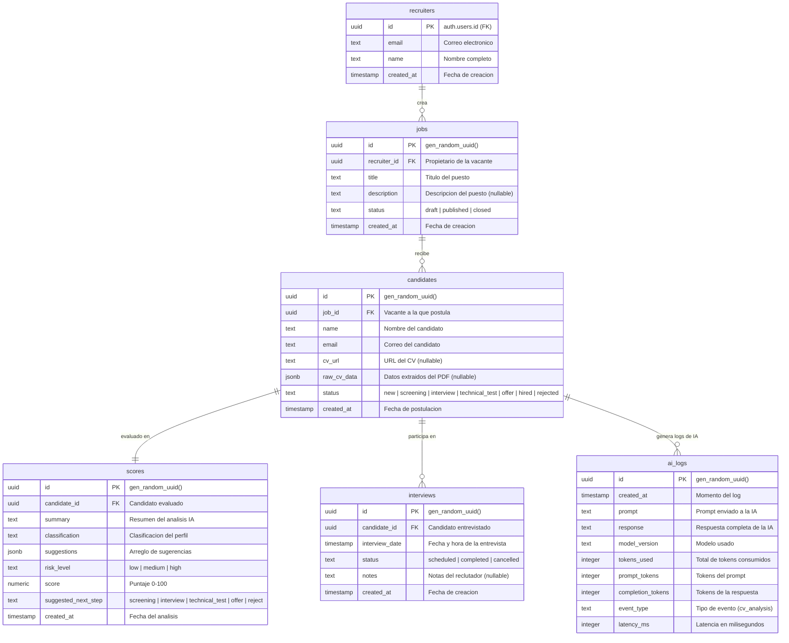
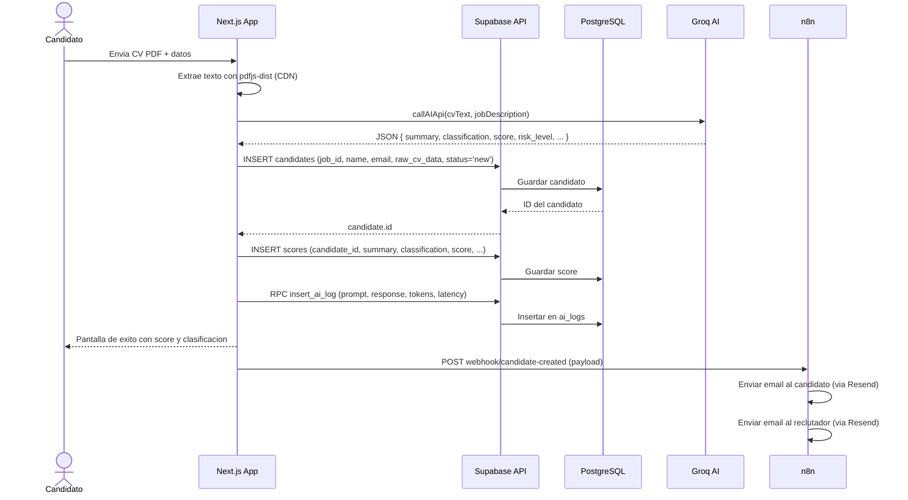

# Base de Datos - AI Recruitment Platform

> **Motor:** PostgreSQL 15+ (Supabase)  
> **Esquema:** `public`  
> **Fecha:** Junio 2026

---

## Tabla de contenidos

1. [Diagrama entidad-relacion](#1-diagrama-entidad-relacion)
2. [Tablas del sistema](#2-tablas-del-sistema)
   - [public.recruiters](#publicrecruiters)
   - [public.jobs](#publicjobs)
   - [public.candidates](#publiccandidates)
   - [public.interviews](#publicinterviews)
   - [public.scores](#publicscores)
   - [public.ai_logs](#publicai_logs)
3. [Relaciones entre tablas](#3-relaciones-entre-tablas)
4. [Politicas de seguridad (RLS)](#4-politicas-de-seguridad-rls)
5. [Campos de Inteligencia Artificial](#5-campos-de-inteligencia-artificial)
6. [Funciones RPC](#6-funciones-rpc)
7. [Flujo de datos tipico](#7-flujo-de-datos-tipico)

---

## 1. Diagrama entidad-relacion



---

## 2. Tablas del sistema

### `public.recruiters`

Vincula la autenticacion de Supabase Auth con el perfil del reclutador.

| Columna | Tipo | Nulable | Por defecto | Descripcion |
|---------|:----:|:-------:|:-----------:|-------------|
| `id` | `uuid` | NO | - | PK. Referencia a `auth.users.id` |
| `email` | `text` | NO | - | Correo electronico (unique) |
| `name` | `text` | SI | - | Nombre completo |
| `created_at` | `timestamptz` | NO | `now()` | Momento de registro |

### `public.jobs`

Vacantes publicadas por los reclutadores.

| Columna | Tipo | Nulable | Por defecto | Descripcion |
|---------|:----:|:-------:|:-----------:|-------------|
| `id` | `uuid` | NO | `gen_random_uuid()` | PK |
| `recruiter_id` | `uuid` | NO | - | FK → recruiters.id |
| `title` | `text` | NO | - | Titulo del puesto |
| `description` | `text` | SI | - | Descripcion detallada |
| `status` | `text` | NO | `'draft'` | CHECK: `draft`, `published`, `closed` |
| `created_at` | `timestamptz` | NO | `now()` | Fecha de creacion |

### `public.candidates`

Postulaciones recibidas para cada vacante.

| Columna | Tipo | Nulable | Por defecto | Descripcion |
|---------|:----:|:-------:|:-----------:|-------------|
| `id` | `uuid` | NO | `gen_random_uuid()` | PK |
| `job_id` | `uuid` | NO | - | FK → jobs.id |
| `name` | `text` | NO | - | Nombre del candidato |
| `email` | `text` | NO | - | Correo electronico |
| `cv_url` | `text` | SI | - | URL del PDF (reservado) |
| `raw_cv_data` | `jsonb` | SI | - | Datos extraidos del PDF |
| `status` | `text` | NO | `'new'` | CHECK: 7 etapas del pipeline |
| `created_at` | `timestamptz` | NO | `now()` | Fecha de postulacion |

**Valores del CHECK en `status`:** `'new'`, `'screening'`, `'interview'`, `'technical_test'`, `'offer'`, `'hired'`, `'rejected'`

### `public.interviews`

Entrevistas agendadas para candidatos.

| Columna | Tipo | Nulable | Por defecto | Descripcion |
|---------|:----:|:-------:|:-----------:|-------------|
| `id` | `uuid` | NO | `gen_random_uuid()` | PK |
| `candidate_id` | `uuid` | NO | - | FK → candidates.id |
| `interview_date` | `timestamptz` | NO | - | Fecha y hora de la entrevista |
| `status` | `text` | NO | `'scheduled'` | CHECK: `scheduled`, `completed`, `cancelled` |
| `notes` | `text` | SI | - | Notas adicionales |
| `created_at` | `timestamptz` | NO | `now()` | Fecha de creacion |

### `public.scores`

Resultados del analisis de IA para cada candidato.

| Columna | Tipo | Nulable | Por defecto | Descripcion |
|---------|:----:|:-------:|:-----------:|-------------|
| `id` | `uuid` | NO | `gen_random_uuid()` | PK |
| `candidate_id` | `uuid` | NO | - | FK → candidates.id |
| `summary` | `text` | NO | - | Resumen de 2-3 oraciones |
| `classification` | `text` | NO | - | Categoria del perfil (ej: "Senior Frontend") |
| `suggestions` | `jsonb` | SI | `'[]'` | Arreglo de sugerencias accionables |
| `risk_level` | `text` | NO | - | CHECK: `low`, `medium`, `high` |
| `score` | `numeric` | NO | - | CHECK: 0 <= score <= 100 |
| `suggested_next_step` | `text` | SI | - | `screening`, `interview`, `technical_test`, `offer`, `reject` |
| `created_at` | `timestamptz` | NO | `now()` | Fecha del analisis |

### `public.ai_logs`

Auditoria de todas las llamadas al modelo de IA.

| Columna | Tipo | Nulable | Por defecto | Descripcion |
|---------|:----:|:-------:|:-----------:|-------------|
| `id` | `uuid` | NO | `gen_random_uuid()` | PK |
| `created_at` | `timestamptz` | NO | `timezone('utc', now())` | Momento del log |
| `prompt` | `text` | SI | - | Prompt completo enviado |
| `response` | `text` | SI | - | Respuesta completa del modelo |
| `model_version` | `text` | SI | - | `llama-3.3-70b-versatile` |
| `tokens_used` | `integer` | SI | - | Total de tokens |
| `prompt_tokens` | `integer` | SI | - | Tokens del prompt |
| `completion_tokens` | `integer` | SI | - | Tokens de la respuesta |
| `event_type` | `text` | SI | - | Tipo de evento (`cv_analysis`) |
| `latency_ms` | `integer` | SI | - | Latencia en milisegundos |

---

## 3. Relaciones entre tablas

### Resumen de Llaves Foraneas

| Columna FK | Tabla origen | Tabla destino | Nulable | Descripcion |
|------------|-------------|---------------|:-------:|-------------|
| `recruiters.id` | `recruiters` | `auth.users` | NO | Identidad del reclutador |
| `jobs.recruiter_id` | `jobs` | `recruiters` | NO | Propietario de la vacante |
| `candidates.job_id` | `candidates` | `jobs` | NO | Vacante a la que postula |
| `interviews.candidate_id` | `interviews` | `candidates` | NO | Candidato entrevistado |
| `scores.candidate_id` | `scores` | `candidates` | NO | Candidato evaluado |

### Cardinalidad

```
recruiters (1) ──< jobs (N)         Un recruiter puede crear muchas vacantes
jobs (1) ──< candidates (N)         Una vacante puede recibir muchos candidatos
candidates (1) ──|| scores (1)      Un candidato tiene un solo score (relacion 1:1 logica)
candidates (1) ──< interviews (N)   Un candidato puede tener varias entrevistas
```

---

## 4. Politicas de seguridad (RLS)

Row Level Security esta habilitado en todas las tablas. A continuacion, las politicas implementadas:

### `public.recruiters`

| Politica | Operacion | Condicion |
|----------|:---------:|-----------|
| Ver propio perfil | `SELECT` | `auth.uid() = id` |
| Actualizar propio perfil | `UPDATE` | `auth.uid() = id` |

### `public.jobs`

| Politica | Operacion | Condicion |
|----------|:---------:|-----------|
| Crear vacante | `INSERT` | `recruiter_id = auth.uid()` |
| Ver vacantes propias | `SELECT` | `recruiter_id = auth.uid()` |
| Actualizar vacante propia | `UPDATE` | `recruiter_id = auth.uid()` |
| Eliminar vacante propia | `DELETE` | `recruiter_id = auth.uid()` |
| Leer vacantes publicadas | `SELECT` | `status = 'published'` (acceso publico) |

### `public.candidates`

| Politica | Operacion | Condicion |
|----------|:---------:|-----------|
| Insertar candidato | `INSERT` | El reclutador es dueno del `job_id` asociado |
| Ver candidatos | `SELECT` | El reclutador es dueno del `job_id` asociado |
| Actualizar candidato | `UPDATE` | El reclutador es dueno del `job_id` asociado |
| Eliminar candidato | `DELETE` | El reclutador es dueno del `job_id` asociado |

### `public.interviews`

| Politica | Operacion | Condicion |
|----------|:---------:|-----------|
| Insertar entrevista | `INSERT` | Reclutador dueno via `candidates → jobs` |
| Ver entrevistas | `SELECT` | Reclutador dueno via `candidates → jobs` |
| Actualizar entrevista | `UPDATE` | Reclutador dueno via `candidates → jobs` |
| Eliminar entrevista | `DELETE` | Reclutador dueno via `candidates → jobs` |

### `public.scores`

| Politica | Operacion | Condicion |
|----------|:---------:|-----------|
| Insertar score | `INSERT` | Reclutador dueno via `candidates → jobs` |
| Ver scores | `SELECT` | Reclutador dueno via `candidates → jobs` |
| Actualizar score | `UPDATE` | Reclutador dueno via `candidates → jobs` |
| Eliminar score | `DELETE` | Reclutador dueno via `candidates → jobs` |

### `public.ai_logs`

| Politica | Operacion | Condicion |
|----------|:---------:|-----------|
| Ver logs | `SELECT` | `auth.role() = 'authenticated'` |
| Insertar logs | `INSERT` | `auth.role() = 'authenticated'` |

**Nota:** Las politicas de `candidates`, `interviews` y `scores` usan subconsultas para verificar la cadena de propiedad: `EXISTS (SELECT 1 FROM candidates JOIN jobs ON jobs.id = candidates.job_id WHERE candidates.id = X AND jobs.recruiter_id = auth.uid())`.

---

## 5. Campos de Inteligencia Artificial

La tabla `scores` contiene los resultados del analisis del modelo Groq (`llama-3.3-70b-versatile`). La tabla `ai_logs` guarda la auditoria completa de cada llamada.

### Entradas del sistema IA

| Campo de entrada | Fuente |
|------------------|--------|
| `cvText` | Texto extraido del PDF del candidato |
| `jobDescription` | Descripcion de la vacante |

### Salidas del sistema IA (tabla `scores`)

| Campo | Tipo | Valores tipicos | Proposito |
|-------|:----:|-----------------|-----------|
| `summary` | `text` | "El candidato muestra experiencia en React y Node.js..." | Resumen de adecuacion al puesto |
| `classification` | `text` | "Senior Frontend", "Junior Backend", "Data Analyst" | Categoria del perfil |
| `suggestions` | `jsonb` | `["Destacar logros cuantificables", "Incluir proyectos"]` | Sugerencias accionables |
| `risk_level` | `text` | `"low"`, `"medium"`, `"high"` | Riesgo de contratacion |
| `score` | `numeric` | 0-100 | Puntaje de compatibilidad |
| `suggested_next_step` | `text` | `"screening"`, `"interview"`, `"technical_test"`, `"offer"`, `"reject"` | Siguiente accion recomendada |

### Auditoria (tabla `ai_logs`)

| Campo | Proposito |
|-------|-----------|
| `prompt` | Prompt exacto enviado al modelo |
| `response` | Respuesta completa del modelo |
| `model_version` | `llama-3.3-70b-versatile` |
| `tokens_used` | Total de tokens consumidos |
| `prompt_tokens` | Tokens del prompt (para calculo de costos) |
| `completion_tokens` | Tokens de la respuesta (para calculo de costos) |
| `event_type` | `cv_analysis` |
| `latency_ms` | Tiempo de respuesta en ms |

### Calculo de costos

```
Costo = (prompt_tokens * 0.59 / 1,000,000) + (completion_tokens * 0.79 / 1,000,000)
```

---

## 6. Funciones RPC

### `insert_ai_log`

Inserta un registro en `ai_logs` con `SECURITY DEFINER` para evitar problemas de caché del schema en PostgREST.

```sql
CREATE OR REPLACE FUNCTION insert_ai_log(
  p_event_type TEXT,
  p_prompt TEXT,
  p_response TEXT,
  p_model_version TEXT,
  p_tokens_used INT,
  p_prompt_tokens INT,
  p_completion_tokens INT,
  p_latency_ms INT
) RETURNS VOID
SECURITY DEFINER
SET search_path = public
LANGUAGE plpgsql AS $$
BEGIN
  INSERT INTO ai_logs (event_type, prompt, response, model_version, tokens_used, prompt_tokens, completion_tokens, latency_ms)
  VALUES (p_event_type, p_prompt, p_response, p_model_version, p_tokens_used, p_prompt_tokens, p_completion_tokens, p_latency_ms);
END;
$$;
```

### `update_candidate_stage`

Actualiza el estado de un candidato con validacion.

```sql
CREATE OR REPLACE FUNCTION update_candidate_stage(
  p_candidate_id UUID,
  p_new_status TEXT
) RETURNS VOID
LANGUAGE plpgsql AS $$
BEGIN
  UPDATE candidates SET status = p_new_status WHERE id = p_candidate_id;
END;
$$;
```

### `schedule_interview`

Crea una entrevista desactivando temporalmente el trigger de la tabla.

```sql
CREATE OR REPLACE FUNCTION schedule_interview(
  p_candidate_id UUID,
  p_interview_date TIMESTAMPTZ,
  p_notes TEXT DEFAULT NULL
) RETURNS UUID
LANGUAGE plpgsql AS $$
DECLARE
  v_id UUID;
BEGIN
  ALTER TABLE interviews DISABLE TRIGGER ALL;
  INSERT INTO interviews (candidate_id, interview_date, notes)
  VALUES (p_candidate_id, p_interview_date, p_notes)
  RETURNING id INTO v_id;
  ALTER TABLE interviews ENABLE TRIGGER ALL;
  RETURN v_id;
END;
$$;
```

---

## 7. Flujo de datos tipico



---

*Documentacion generada en Junio 2026 para el proyecto AI Recruitment Platform.*
