# Diagramas de Flujo - AI Recruitment Platform

> **Nota:** Todos los diagramas usan sintaxis Mermaid.js y son renderizados nativamente por GitHub.

---

## 1. Arquitectura del sistema

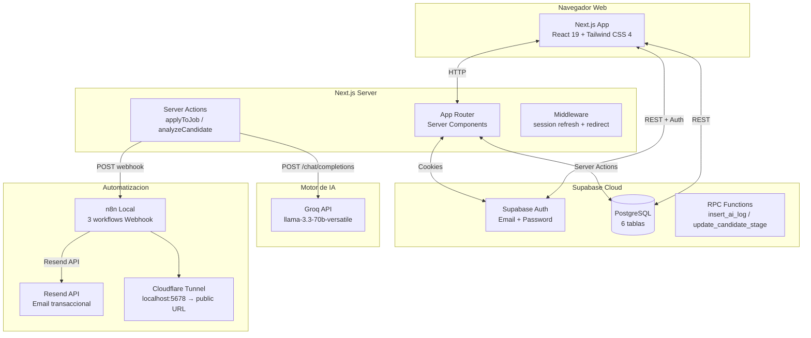

---

## 2. Flujo de autenticacion

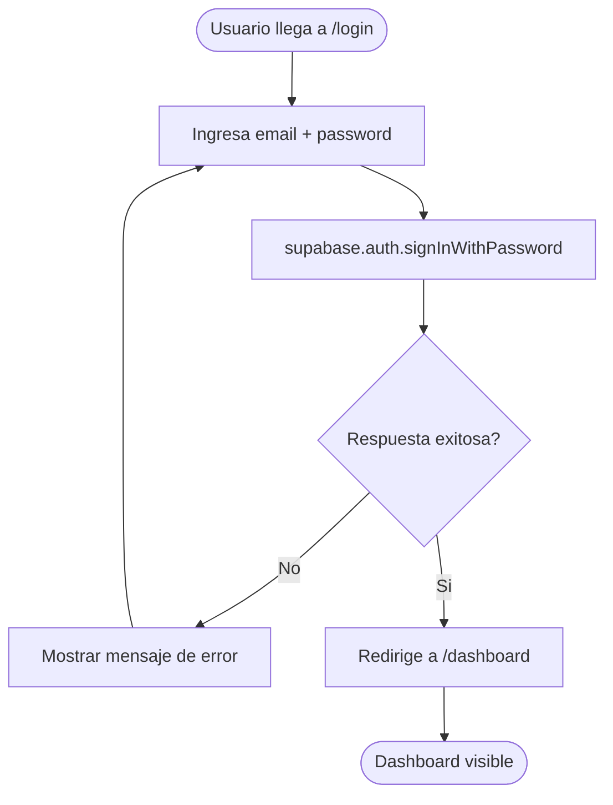

---

## 3. Flujo de registro

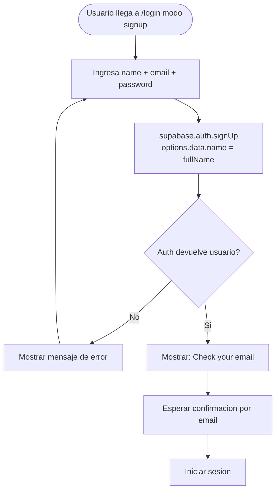

---

## 4. Flujo de middleware

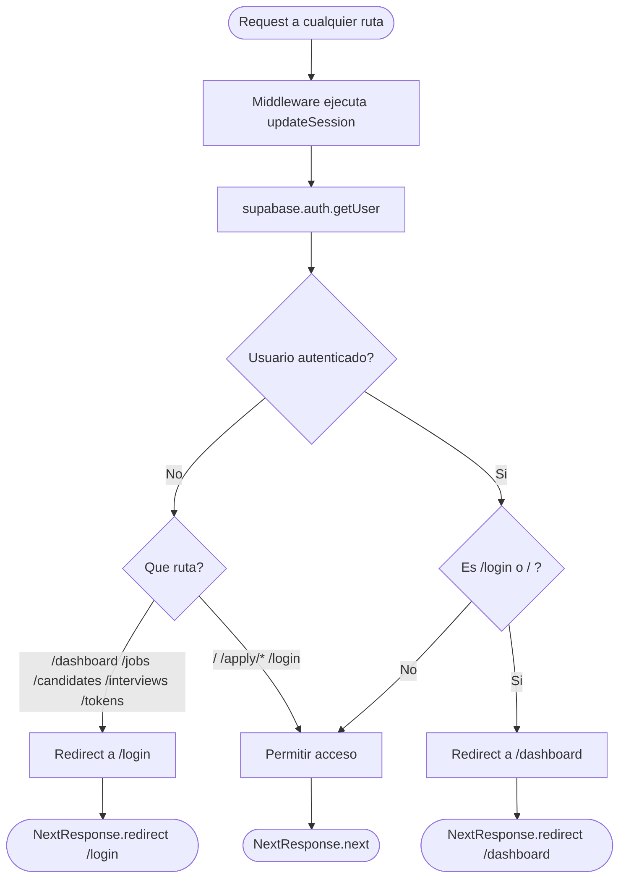

---

## 5. Flujo de analisis CV con IA

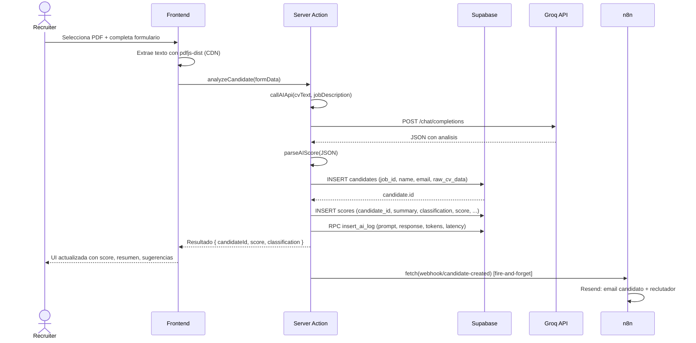

---

## 6. Flujo de postulacion publica

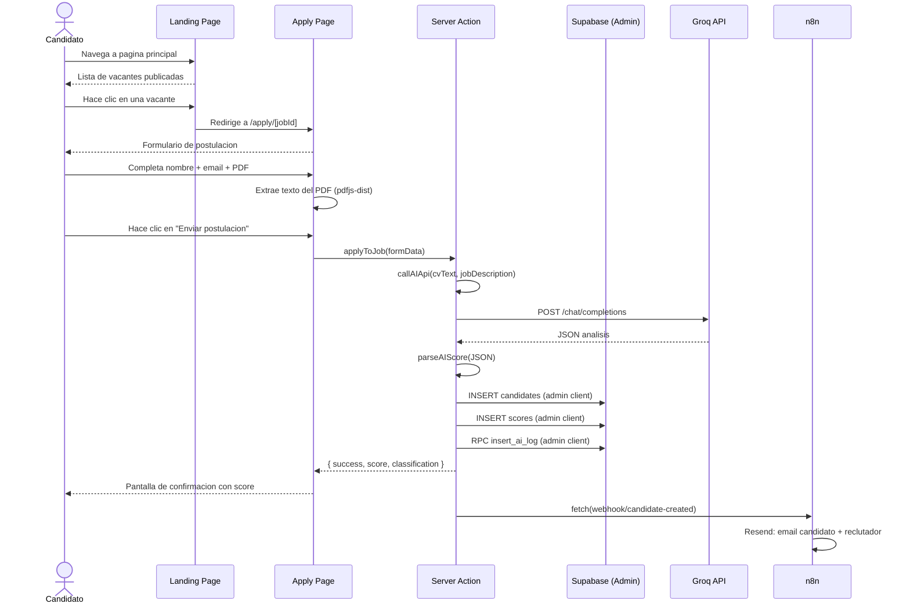

---

## 7. Workflows de n8n

### 7.1 Candidate Created

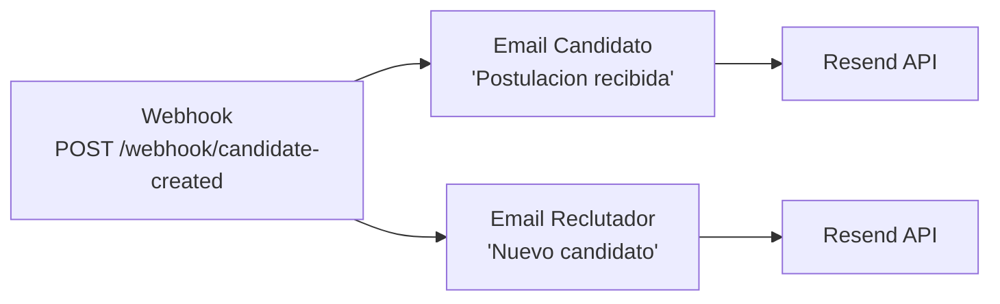

### 7.2 Candidate Stage Change

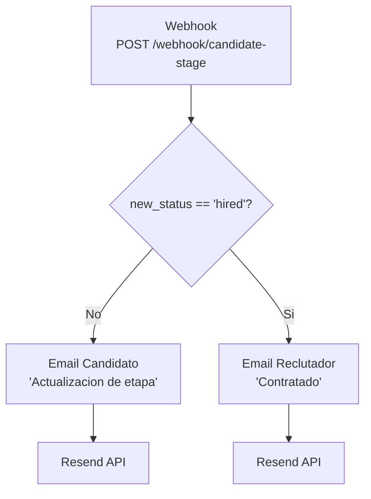

### 7.3 Interview Scheduled

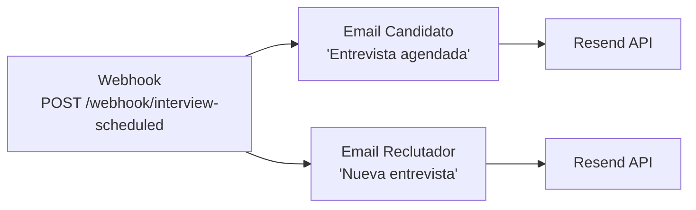

---

## 8. Flujo de programacion de entrevista

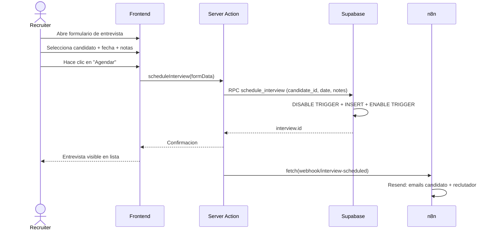

---

## 9. Diagrama de componentes

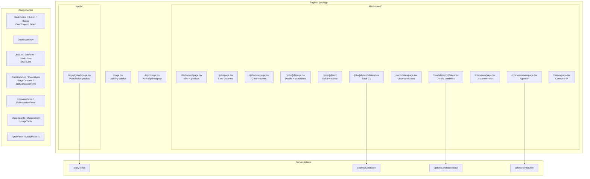

---

## 10. Diagrama de navegacion

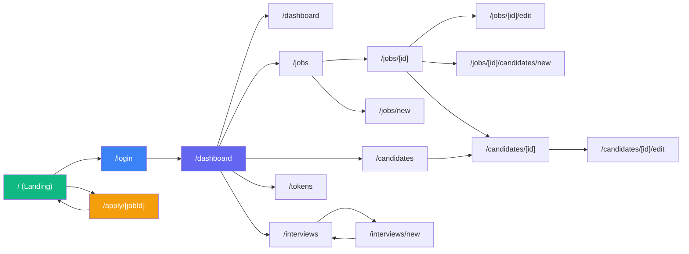

---

## 11. Matriz de permisos

| # | Capacidad | Reclutador | Publico |
|:-:|-----------|:----------:|:-------:|
| 1 | Ver landing page | ✓ | ✓ |
| 2 | Ver vacantes publicadas | ✓ | ✓ |
| 3 | Postularse a una vacante | ✗ | ✓ |
| 4 | Iniciar sesion / registrarse | ✓ | ✓ |
| 5 | Ver dashboard con metricas | ✓ | ✗ |
| 6 | Crear / editar / eliminar vacantes | ✓ | ✗ |
| 7 | Publicar / cerrar vacantes | ✓ | ✗ |
| 8 | Subir y analizar CVs | ✓ | ✗ |
| 9 | Ver lista de candidatos | ✓ | ✗ |
| 10 | Mover candidatos entre etapas | ✓ | ✗ |
| 11 | Agendar / editar entrevistas | ✓ | ✗ |
| 12 | Ver consumo de tokens | ✓ | ✗ |
| 13 | Compartir enlace de postulacion | ✓ | ✗ |

> **Leyenda:** ✓ = Permitido | ✗ = Denegado

---

## 12. Flujo de datos de Supabase

### Canales de datos entre frontend y backend

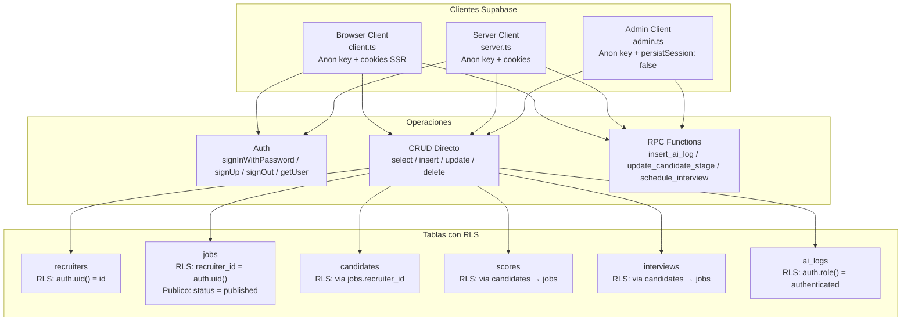

---

*Documentacion generada en Junio 2026 para el proyecto AI Recruitment Platform.*
