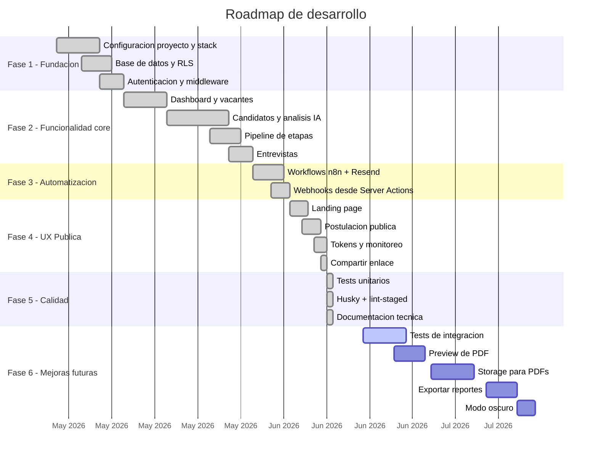

# Metodologia de Desarrollo - AI Recruitment Platform

> **Version:** 1.0.0  
> **Fecha:** Junio 2026

---

## Tabla de contenidos

1. [Enfoque de desarrollo](#1-enfoque-de-desarrollo)
2. [Stack tecnologico y justificacion](#2-stack-tecnologico-y-justificacion)
3. [Estructura del proyecto](#3-estructura-del-proyecto)
4. [Proceso de desarrollo](#4-proceso-de-desarrollo)
5. [Seguridad y control de acceso](#5-seguridad-y-control-de-acceso)
6. [Manejo de estado](#6-manejo-de-estado)
7. [Decisiones tecnicas clave](#7-decisiones-tecnicas-clave)
8. [Funcionalidades pendientes o por implementar](#8-funcionalidades-pendientes-o-por-implementar)
9. [Roadmap sugerido](#9-roadmap-sugerido)

---

## 1. Enfoque de desarrollo

El proyecto fue desarrollado siguiendo los principios de **desarrollo rapido con plataformas backend-as-a-service (BaaS)**, minimizando la infraestructura propia y maximizando el uso de servicios gestionados.

### Principios rectores

| Principio | Aplicacion |
|-----------|------------|
| **Serverless first** | Sin servidores propios. Supabase maneja autenticacion, base de datos y RLS. n8n corre local solo para desarrollo |
| **Server Components** | Maximo uso de Server Components de Next.js para reducir JavaScript del lado del cliente |
| **Server Actions** | Toda la logica de negocio (analisis IA, CRUD, webhooks) se ejecuta en Server Actions |
| **Seguridad por capas** | Middleware + RLS en base de datos + clientes separados por contexto (browser, server, admin) |
| **Fire-and-forget** | Las notificaciones a n8n son asincronas y no bloquean la respuesta al usuario |

---

## 2. Stack tecnologico y justificacion

| Tecnologia | Por que fue elegida |
|------------|---------------------|
| **Next.js 15** | Framework React con Server Components, App Router y Server Actions. Permite construir aplicaciones full-stack con un solo proyecto |
| **React 19** | Ultima version estable con Server Components, useActionState para formularios, y use() para promesas |
| **Supabase** | Alternativa open-source a Firebase. Proporciona Postgres, Auth, RLS y RPCs en un solo producto |
| **Tailwind CSS 4** | Utility-first CSS con configuracion minima. La version 4 elimina la necesidad de `tailwind.config.js` |
| **Groq API** | Proveedor de LLM con alta velocidad de inferencia. Modelo `llama-3.3-70b-versatile` con buen balance costo-calidad |
| **n8n** | Automatizacion low-code para flujos de notificacion por email. Se conecta via webhooks desde las Server Actions |
| **Resend** | API de email transaccional moderna con SDK sencillo. Plan gratuito suficiente para desarrollo y pruebas |
| **Cloudflare Tunnel** | Expone n8n local a internet sin necesidad de desplegarlo en un servidor publico |
| **pdfjs-dist** | Libreria madura de Mozilla para extraer texto de PDFs. Se carga desde CDN para evitar errores de bundling |

### Por que NO se usaron

| Tecnologia | Motivo |
|------------|--------|
| **API Routes de Next.js** | Supabase RLS + Server Actions permiten operaciones directas sin necesidad de una capa API intermedia |
| **Zustand / Redux** | El estado de la aplicacion es mayormente local a cada pagina o se obtiene del servidor en cada request |
| **tRPC / GraphQL** | La complejidad no lo justifica. Las consultas son CRUD directo a Supabase con relaciones simples |
| **Prisma / Drizzle** | Supabase incluye su propio cliente SQL con tipado generado. No se requiere otro ORM |
| **OpenAI / Claude** | Se eligio Groq por su velocidad de inferencia y costo. El prompt y la estructura JSON son compatibles con cualquier LLM |

---

## 3. Estructura del proyecto

### Patron de organizacion

```
src/
├── app/                        # App Router (paginas y layouts)
│   ├── layout.tsx              # Layout raiz (Server Component)
│   ├── page.tsx                # Landing page publica
│   ├── globals.css             # Estilos globales + Tailwind
│   ├── middleware.ts            # Session refresh + redirect
│   ├── (auth)/                 # Agrupacion de rutas de auth
│   │   └── login/page.tsx      # Auth signin/signup
│   ├── (dashboard)/            # Agrupacion de rutas protegidas
│   │   ├── layout.tsx          # Layout con DashboardNav
│   │   ├── _components/        # Componentes internos del layout
│   │   ├── dashboard/          # KPIs y metricas
│   │   ├── jobs/               # CRUD de vacantes
│   │   ├── candidates/         # Lista y detalle de candidatos
│   │   ├── interviews/         # CRUD de entrevistas
│   │   └── tokens/             # Consumo de IA
│   └── apply/                  # Postulacion publica
│       ├── layout.tsx          # Layout minimo (sin navbar)
│       └── [jobId]/            # Formulario de postulacion
│           ├── page.tsx        # Cliente con useActionState
│           └── actions.ts      # Server Action publico
├── components/                 # Componentes reutilizables por dominio
├── lib/                        # Logica compartida
│   ├── supabase/               # Clientes de Supabase
│   └── ai.ts                   # callAIApi + parseAIScore
└── test/                       # Setup de testing
```

### Convenciones

- Archivos `.tsx` para componentes con JSX, `.ts` para logica pura
- Alias `@/` para importar desde `src/` (configurado en `tsconfig.json`)
- Nombres en PascalCase para componentes (`ApplyForm.tsx`)
- Nombres en kebab-case para rutas (`[jobId]/page.tsx`)
- Server Actions en archivos `actions.ts` dentro del directorio de la ruta

---

## 4. Proceso de desarrollo

### Fase 1: Configuracion del proyecto

1. Creacion del proyecto con `create-next-app`
2. Instalacion de dependencias: `@supabase/ssr`, `@supabase/supabase-js`, `tailwindcss`
3. Configuracion de PostCSS y Tailwind v4
4. Creacion de clientes Supabase (browser, server, middleware, admin)
5. Configuracion de variables de entorno
6. Configuracion de ESLint y TypeScript

### Fase 2: Base de datos y autenticacion

1. Diseno del esquema PostgreSQL con 6 tablas
2. Creacion de migraciones SQL (001 a 005)
3. Configuracion de RLS para todas las tablas
4. Implementacion de autenticacion SSR con cookies
5. Creacion del trigger de perfil (insercion automatica en recruiters)
6. Creacion de RPCs (insert_ai_log, update_candidate_stage, schedule_interview)

### Fase 3: Dashboard y vacantes

1. Layout protegido con DashboardNav
2. Pagina de dashboard con KPIs y graficos
3. CRUD completo de vacantes (crear, listar, detalle, editar, eliminar)
4. Formulario de vacante con estados (draft, published, closed)

### Fase 4: Candidatos y analisis IA

1. Subida de CV en PDF con extraccion de texto via pdfjs-dist (CDN)
2. Integracion con Groq API para analisis de CV
3. Funcion parseAIScore con validacion estricta de JSON
4. Pipeline de 7 etapas (new → screening → interview → technical_test → offer → hired → rejected)
5. Vista de detalle con score visual, clasificacion, riesgo y sugerencias

### Fase 5: Entrevistas

1. CRUD completo de entrevistas (agendar, listar, editar, completar, cancelar)
2. RPC schedule_interview con manejo de triggers
3. Integracion con webhook de n8n para notificaciones

### Fase 6: Automatizacion n8n

1. Creacion de 3 workflows en n8n
2. Configuracion de webhooks con payload estructurado
3. Plantillas HTML de email con diseno corporativo
4. Configuracion de Resend como proveedor de email
5. Tunnel Cloudflare para exponer n8n local

### Fase 7: Landing page y postulacion publica

1. Landing page con hero, caracteristicas y vacantes publicas
2. Formulario de postulacion con extraccion de PDF
3. Server Action publico con admin client
4. Pagina de confirmacion con score y clasificacion
5. RLS policy para lectura publica de vacantes publicadas

### Fase 8: Tokens y monitoreo

1. Pagina de tokens con 4 KPIs (tokens, costos, llamadas, latencia)
2. Grafico de barras de 7 dias
3. Tabla de logs con costo calculado por llamada
4. RPC insert_ai_log con SECURITY DEFINER para bypass de schema cache

### Fase 9: Pruebas y calidad

1. Instalacion de Vitest + Testing Library
2. Tests unitarios para parseAIScore (15 tests)
3. Tests de componentes (Button, Badge, BackButton, ApplySuccess)
4. Configuracion de Husky + lint-staged
5. Hooks pre-commit (lint) y pre-push (typecheck)

### Fase 10: Despliegue

1. Configuracion en Vercel
2. Variables de entorno en Vercel
3. Build de produccion exitoso
4. Documentacion tecnica en `docs/`

---

## 5. Seguridad y control de acceso

### Estrategia de seguridad multicapa

```
Capa 1: Supabase Auth
  └── Autenticacion via email/password con JWT
  └── Sesion manejada via cookies SSR

Capa 2: Middleware de Next.js
  └── Refresca la sesion en cada request
  └── Redirige usuarios no autenticados fuera de rutas protegidas
  └── Redirige usuarios autenticados desde /login y / hacia /dashboard

Capa 3: Row Level Security (RLS)
  └── Politicas a nivel de fila en PostgreSQL
  └── Cadena de propiedad: recruiters → jobs → candidates → interviews/scores
  └── Publico puede leer vacantes con status = 'published'

Capa 4: Clientes de Supabase segregados
  └── browser: anon key + cookies SSR
  └── server: anon key + cookies server-side
  └── admin: anon key + persistSession: false (sin service_role en frontend)

Capa 5: RPC SECURITY DEFINER
  └── insert_ai_log usa SECURITY DEFINER para evitar cache de schema
  └── No expone la service_role key al codigo del frontend
```

### Principio de minimo privilegio

Cada usuario accede solo a los datos que necesita:

- **Reclutador autenticado:** solo sus vacantes, los candidatos de sus vacantes, scores y entrevistas asociadas
- **Usuario anonimo:** solo puede ver vacantes publicadas y postularse
- **ai_logs:** cualquier usuario autenticado puede leerlos (via admin client)

---

## 6. Manejo de estado

### Sin estado global

El proyecto NO utiliza bibliotecas de estado global (Zustand, Redux, Jotai, etc.). El estado se maneja de forma:

1. **Local a cada componente:** `useState` para formularios, filtros, modales
2. **Server Components:** los datos se obtienen directamente en el servidor y se pasan como props
3. **Server Actions:** las mutaciones se ejecutan en el servidor y el cliente se refresca via `revalidatePath()` o `router.refresh()`
4. **URL state:** `useSearchParams()` para filtros y busquedas compartibles
5. **Form state:** `useActionState()` para manejo de errores y loading en formularios

### Patron de datos

```
Server Component → fetch(Supabase) → render(props)
                                        ↓
Cliente interactua → Server Action → mutate(Supabase)
                                        ↓
                             revalidatePath() / router.refresh()
                                        ↓
                             Server Component se re-renderiza
```

---

## 7. Decisiones tecnicas clave

### 7.1. Admin client sin service_role key

**Decision:** `createAdminClient()` usa la anon key con `persistSession: false` en lugar de una service_role key.

**Motivo:** Evita exponer una key con privilegios elevados. Las operaciones que necesitan bypass de RLS (insercion de candidatos desde el flujo publico, lectura de ai_logs) se hacen mediante la funcion RPC `insert_ai_log` con `SECURITY DEFINER` y consultas directas que las politicas RLS ya permiten.

### 7.2. RPC para insert_ai_log

**Decision:** Crear una funcion RPC `insert_ai_log` en lugar de insertar directamente via `admin.from("ai_logs").insert()`.

**Motivo:** La cache de schema de PostgREST no detectaba las columnas `event_type` y `latency_ms` que se agregaron despues de la creacion inicial de la tabla. La funcion RPC con `SECURITY DEFINER` y `SET search_path = public` bypassa esta cache.

### 7.3. pdfjs-dist desde CDN

**Decision:** Cargar pdfjs-dist desde cdnjs en lugar del paquete npm.

**Motivo:** El paquete npm causaba un error `TypeError: Object.defineProperty` al hacer build con Webpack. La carga desde CDN con `/* webpackIgnore: true */` evita el bundling y funciona correctamente en runtime.

### 7.4. Webhooks fire-and-forget

**Decision:** Las llamadas a n8n se hacen con `AbortSignal.timeout(5000)` sin esperar la respuesta.

**Motivo:** El envio de email no debe bloquear la respuesta al usuario. Si n8n esta caido o el tunel Cloudflare no responde, la operacion principal (guardar candidato, agendar entrevista) no se ve afectada.

### 7.5. Server Actions para logica de negocio

**Decision:** Toda la logica de negocio (analisis IA, CRUD, notificaciones) se ejecuta en Server Actions, no en API Routes.

**Motivo:** Las Server Actions se integran naturalmente con el App Router, permiten formularios progresivos con `useActionState()`, y ejecutan codigo del lado del servidor sin necesidad de crear endpoints REST.

### 7.6. Middleware para auth, no layout guard

**Decision:** La proteccion de rutas se maneja en `middleware.ts` en lugar de un layout guardian.

**Motivo:** El middleware se ejecuta antes de que cualquier componente se renderice, evitando flickers de carga y proporcionando redireccion inmediata. Ademas, refresca la sesion en cada request, manteniendo las cookies sincronizadas.

### 7.7. Unico rol (Recruiter)

**Decision:** La aplicacion tiene un solo rol de usuario, a diferencia del proyecto de tickets que tiene 3 roles.

**Motivo:** El flujo de reclutamiento es inherentemente individual: un reclutador maneja todo el proceso. No hay separacion entre agente y admin. Esto simplifica el modelo de permisos y la interfaz.

### 7.8. n8n local + Cloudflare Tunnel

**Decision:** n8n corre localmente y se expone via Cloudflare Tunnel en lugar de desplegarlo en un servidor.

**Motivo:** Reduce costos de infraestructura. El tunel Cloudflare proporciona una URL publica temporal cada vez que se reinicia. Es adecuado para desarrollo y presentacion, pero para produccion se recomendaria desplegar n8n en un servicio como Railway o Render.

### 7.9. Resend free tier (email limitado)

**Decision:** Usar el plan gratuito de Resend que solo permite enviar a la direccion verificada del owner.

**Motivo:** Suficiente para desarrollo, pruebas y presentacion. Todos los emails (candidato y reclutador) se envian a `cesarvelasquez150814@gmail.com`. Para produccion, se requiere un plan pago de Resend que permita enviar a cualquier destinatario.

### 7.10. Calculo de costos de IA

**Decision:** Los costos se calculan con las tarifas exactas de Groq: `prompt_tokens * 0.59/1M + completion_tokens * 0.79/1M`.

**Motivo:** Permite al reclutador tener visibilidad del costo real de cada analisis de CV. Los registros sin datos de tokens (de cuando no se habia implementado el contador) se estiman con un split 70/30 del total de tokens.

---

## 8. Funcionalidades pendientes o por implementar

### Criticas

| Funcionalidad | Ubicacion | Estado |
|--------------|-----------|--------|
| Test de integracion de Server Actions | `src/__tests__/` | No implementado |
| Preview de PDF antes de subir | `ApplyForm.tsx` | No implementado |
| Paginacion en listas largas | Varias paginas | No implementado |

### Mejoras futuras sugeridas

| Funcionalidad | Prioridad | Descripcion |
|--------------|:---------:|-------------|
| Almacenamiento de PDFs en Supabase Storage | Alta | Actualmente el PDF se procesa en memoria y solo se guarda el texto extraido |
| Multiple analisis IA por candidato | Media | Permitir re-analizar un CV con diferentes prompts o modelos |
| Historial de cambios de etapa | Media | Tabla de auditoria para tracking de movimientos en el pipeline |
| Exportar reportes a PDF/CSV | Media | Descargar metricas del dashboard y listas de candidatos |
| Modo oscuro | Baja | Toggle de tema claro/oscuro |
| Notificaciones en-app | Baja | Campana de notificaciones dentro del dashboard (actualmente solo via email) |
| Carga masiva de CVs | Baja | Subir multiples PDFs simultaneamente |
| Filtros combinados en candidatos | Baja | Filtrar por score + etapa + fecha simultaneamente |

---

## 9. Roadmap sugerido



---

*Documentacion generada en Junio 2026 para el proyecto AI Recruitment Platform.*
